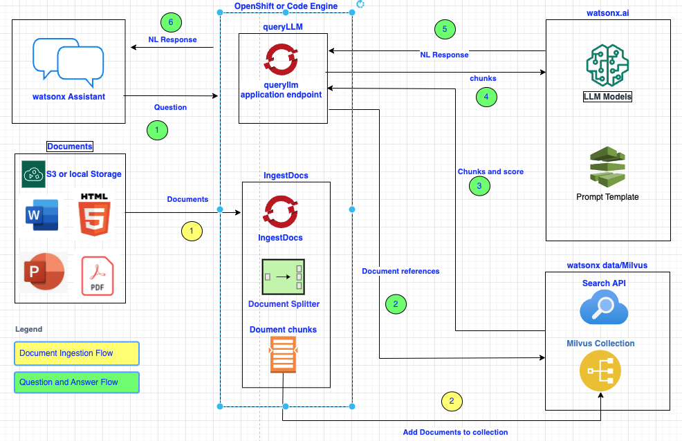

# Milvus RAG Application

This application exposes APIs to help set up a RAG pipeline using the Milvus service in **watsonx.data** as the document respository.

 

This README will guide you through the steps to deploy the project locally, on OpenShift or IBM Code Engine. Additionally, you will learn how to access the Swagger documentation once the project is deployed.

## Deploying the application

### Deploying locally

To run application on your local machine, follow these steps:

1. Navigate to the project directory:

    ```bash
    cd milvus-rag-service/application
    ```

3. Create a Python Enviroment, Activate it, and Install Requirements:

    ```bash
    python -m venv assetEnv
    source assetEnv/bin/activate
    pip install -r requirements.txt
    python prereqs.py
    ```
4. Create a RAG prompt template

    •	Create a new prompt template and enter the following prompt in the FreeForm tab
        
        <|begin_of_text|><|start_header_id|>system<|end_header_id|> You are an assistant for answering questions based on provided documents. You are given the extracted parts of several documents and a question. Provide a conversational answer. Answer with no more than 200 words. If you cannot base your answer on the given document, please state that you do not have an answer. Don't make up an answer. 
    
        Context: {context} 
        Question: {question} <|eot_id|><|start_header_id|>user<|end_header_id|> 

        Answer: <|eot_id|><|start_header_id|>assistant<|end_header_id|>

    •	Select the “llama-3-1-70b-instruct” model.
    •	Add two variables, “context” and “question” with no default values.
    •	Save and promote the template to a Deployment Space
    
5. Update your secrets:

    Copy `env` to `.env` and fill in the variables with your url, passwords, and apikeys.

    See the `env` file for more details on how to find the required values.

    | Name                   | Value                                                                                                 |
    | -----------------------| ----------------------------------------------------------------------------------------------------- |
    | RAG_APP_API_KEY        | Password used in the API header                                                                       |
    | ---------------------- | ----------------------------------------------------------------------------------------------------- |
    | IBM_CLOUD_API_KEY      | IBM Cloud API Key                                                                                     |
    | ---------------------- | ----------------------------------------------------------------------------------------------------- |
    | WX_URL                 | watsonx.ai URL                                                                                        |
    | ---------------------- | ----------------------------------------------------------------------------------------------------- |
    | WX_PROJECT_ID          | watsonx.ai project ID                                                                                 |
    | ---------------------- | ----------------------------------------------------------------------------------------------------- |
    | WX_SPACE_ID            | watsonx.ai Spsce ID where the prmpt templates are deployed                                            |
    | ---------------------- | ----------------------------------------------------------------------------------------------------- |
    | PROMPT_NAME            | RAG prompt template name                                                                              |
    | ---------------------- | ----------------------------------------------------------------------------------------------------- |
    | COS_ENDPOINT           | IBM Cloud Object Stoage end point. example: : https://s3.us-east.cloud-object-storage.appdomain.cloud |
    | ---------------------- | ----------------------------------------------------------------------------------------------------- |
    | COS_AUTH_ENDPOINT      | IBM Cloud authorization end point. example: https://iam.cloud.ibm.com/identity/token                  |
    | ---------------------- | ----------------------------------------------------------------------------------------------------- |
    | COS_BUCKET_NAME        | IBM Cloud Object Storage bucket name                                                                  |
    | ---------------------- | ----------------------------------------------------------------------------------------------------- |
    | DEFAULT_DOCS_FOLDER    | Folder used to store documents for data injestion to Milvus                                           |
    | ---------------------- | ----------------------------------------------------------------------------------------------------- |
    | WXD_MILVUS_HOST        | Hostname od the Milvus service to connect to                                                          |
    | ---------------------- | ----------------------------------------------------------------------------------------------------- |
    | WXD_MILVUS_PORT        | Port of Milvus service to connect to                                                                  |
    | ---------------------- | ----------------------------------------------------------------------------------------------------- |
    | WXD_MILVUS_USER        | Username for accessing the datasource                                                                 |
    | ---------------------- | ----------------------------------------------------------------------------------------------------- |
    | WXD_MILVUS_PASSWORD    | The password associated with the username to access the datasource                                    |
    | ---------------------- | ----------------------------------------------------------------------------------------------------- |
    | WXD_MILVUS_COLLECTION  | Milvus Collection name. The Collection will be created if it does not exist                           |
    | ---------------------- | ----------------------------------------------------------------------------------------------------- |
    | WXD_MILVUS_NUM_RESULTS | Number of results to fetch from Milvus                                                                |
    | ---------------------- | ----------------------------------------------------------------------------------------------------- |
    | WXD_MILVUS_MIN_SCORE   | Minimum score of the result. Default si 2.                                                            |
    | ---------------------- | ----------------------------------------------------------------------------------------------------- |

6. Start the project:

    ```bash
    python app.py
    ```

7. URL access:

    The url, for purposes of using cURL is http://0.0.0.0:4050.

    To access Swagger go to http://0.0.0.0:4050/docs

### Deploying onto OpenShift

You can deploy this application onto a provisioned [Red Hat OpenShift](https://cloud.ibm.com/docs/openshift?topic=openshift-getting-started) cluster. See the steps [here.](./openshift-setup/README.md)

## Using the application APIs

After deploying the application, you can now test the API

### Test from Swagger

Open Swagger by going to `<url>/docs`.

#### ingestDocs

The `ingestDocs` API retrieves documents from local folder, chunks them and ingests them into the specified collection in the connected Milvus database. It will create the collection if it does not exist.

1. Authenticate the `ingestDocs` api by clicking the lock button to the right.  Enter the value you added for the `RAG_APP_API_KEY`.

3. Click the `Try it out` button and customize your request body:
    ```
    {
      "bucket_name": "rag-app-test",
      "chunk_size": "512",
      "chunk_overlap": "256"
    }
    ```

#### ingestDocsCOS

The `ingestDocsCOS` API retrieves documents from a connected Cloud Object Storage bucket, chunks them and ingests them into the specified collection in the connected Milvus database. It will create the collection if it does not exist.

1. Authenticate the `ingestDocsCOS` api by clicking the lock button to the right.  Enter the value you added for the `RAG_APP_API_KEY`.

3. Click the `Try it out` button and customize your request body:
    ```
    {
      "bucket_name": "rag-app-test",
      "chunk_size": "512",
      "chunk_overlap": "256"
    }
    ```
    
#### queryLLM
The `queryLLM` API queries a connected Milvus database then sends the returned text into **watsonx.ai** Prompt Template using the designated LLM to return a natural language response.

1. Authenticate the `queryLLM` api by clicking the lock button to the right.  Enter the value you added for the `RAG_APP_API_KEY`.

3. Click the `Try it out` button and customize your request body:
    ```
    {
    "question": "string",
	"num_results": "5",
	"min_score": "2"
    }
    ```
   
### Test from cURL

To execute this api from command line, use this command: 
```
curl --location '<application url>/queryLLM' \
--header 'Content-Type: application/json' \
--header 'RAG-APP-API-Key: <your custom RAG-APP-API-KEY value>' \
--data '{
  "question": "string"
}'
```
### Test from Postman

1. Open a new tab and from the request type dropdown, select POST. In the url, paste your url (in this example, it's localhost): `http://127.0.0.1:4050/queryLLM`

2. Under Authorization, choose type **API Key**, add the following key/value: `RAG-APP-API-Key`/`<value for RAG_APP_API_KEY from .env>`

3. Under Body, select `raw` and paste the following json:
```
{
  "question": "<your question>",
}
```
4. Hit the blue `SEND` button and wait for your result. 

## Connecting this application to watsonx Assistant

You can connect **watsonx Assistant** to invoke the `queryLLM` API. See the steps [here.](./watsonx-assistant-setup/README.md)

## Troubleshooting
 

## Contributing

This utility is continually being enhanced, improved. To use this Open Source application, we highly recommend you follow these steps:
1) Fork this repo, and work on your own fork. See [Fork a Repo](https://docs.github.com/en/pull-requests/collaborating-with-pull-requests/working-with-forks/fork-a-repo)
2) Set your upstream to be this repo. See [Configuring a remote repository for a fork](https://docs.github.com/en/pull-requests/collaborating-with-pull-requests/working-with-forks/configuring-a-remote-repository-for-a-fork)
3) Sync your fork/clone to this repository periodically before allowing your changes to diverge. See [Syncing a fork branch from the command line](https://docs.github.com/en/pull-requests/collaborating-with-pull-requests/working-with-forks/syncing-a-fork#syncing-a-fork-branch-from-the-command-line)
4) If you want to contribute your changes back to the utility, open a Pull request. See [Proposing changes with pull requests](https://docs.github.com/en/pull-requests/collaborating-with-pull-requests/proposing-changes-to-your-work-with-pull-requests/about-pull-requests)
## License
This code pattern is licensed under the MIT license.  Separate third party code objects invoked within this code pattern are licensed by their respective providers pursuant to their own separate licenses. 
